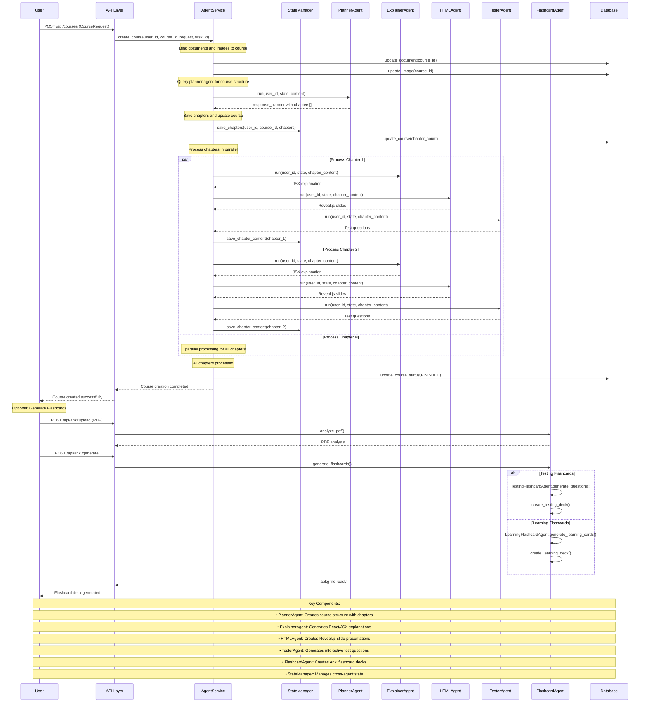

# edu-backend

## Overview


edu-backend is a robust backend service designed for next-generation, AI-driven educational platforms. Built with FastAPI and SQLAlchemy, it enables secure user management, intelligent course content generation, and seamless integration with modern AI and media services. The system is modular, scalable, and ready for both rapid prototyping and production deployment.

## Features

- **Automated Course Generation:**  
	Build dynamic courses from user-uploaded documents, images, and notes using backend AI modules.

- **Intelligent Learning Support:**  
	- Instantly generate quizzes and study materials  
	- Adaptive study plans tailored to user preferences  
	- Per-chapter AI chatbots for contextual Q&A

- **Integrated Learning Tools:**  
	Timers, note-taking, and other backend utilities to enhance the learning process.

- **Rich Media & AI Integration:**  
	- Image search powered by Unsplash API  
	- Google Vertex AI for generating course visuals  

- **Comprehensive User Security:**  
	- Secure registration, login, and session handling  
	- OAuth support (Google, GitHub, Discord)  
	- Admin "login as user" capability  
	- JWT-based authentication with secure cookies

## Technical Diagram



## Tech Stack

- Python
- FastAPI
- SQLAlchemy
- MySQL + ChromaDB (vector storage)
- Google ADK
- AI/ML integrations

## Getting Started

### 1. Clone the repository

```sh
git clone <repo-url>
cd edu-backend
```

### 2. Set up environment variables

Create a `.env` file in the root directory with at least:

```text
DB_USER=your_db_user
DB_PASSWORD=your_db_password
DB_HOST=localhost
DB_PORT=3306
DB_NAME=your_app_db
SECRET_KEY=your_secret_key
SESSION_SECRET_KEY=your_session_secret
ACCESS_TOKEN_EXPIRE_MINUTES=20
REFRESH_TOKEN_EXPIRE_MINUTES=360000
SECURE_COOKIE=true
# OAuth keys (Google, GitHub, Discord)
GOOGLE_CLIENT_ID=...
GOOGLE_CLIENT_SECRET=...
GITHUB_CLIENT_ID=...
GITHUB_CLIENT_SECRET=...
DISCORD_CLIENT_ID=...
DISCORD_CLIENT_SECRET=...
```

### 3. Install dependencies

```sh
pip install -r requirements.txt
```

### 4. Set up the database

- Ensure MySQL is running and the database exists.
- (Optional) For local dev, switch to SQLite by editing `src/config/settings.py`.
- Run migrations or create tables (see Alembic or use SQLAlchemy's `Base.metadata.create_all`).

### 5. Run the server

```sh
uvicorn src.main:app --reload
```

## API Overview

- **/auth/register**: Register a new user
- **/auth/login**: Login and receive tokens
- **/auth/logout**: Logout (clears cookies)
- **/auth/refresh**: Refresh access token
- **/auth/admin/login-as/{user_id}**: Admin impersonation
- **/auth/login/google|github|discord**: OAuth login

Tokens are stored in HTTP-only cookies for security. Use the provided endpoints for authentication flows.

## Project Structure

```text
src/
	main.py                # FastAPI app entrypoint
	agents/                # Agent utilities (query builders, instruction loaders)
	config/                # Settings and environment config
	db/                    # Database models, session, and CRUD
		models/              # SQLAlchemy models (User, Document, Image, etc.)
	services/              # Business logic (auth, etc.)
	utils/                 # Auth and helper utilities
	api/
		routers/             # FastAPI routers (auth, etc.)
		schemas/             # Pydantic schemas
```

## Contributing

Pull requests are welcome! For major changes, please open an issue first to discuss what you would like to change.

## License

Licensed under the Apache License, Version 2.0. See [LICENSE](LICENSE) for details.
